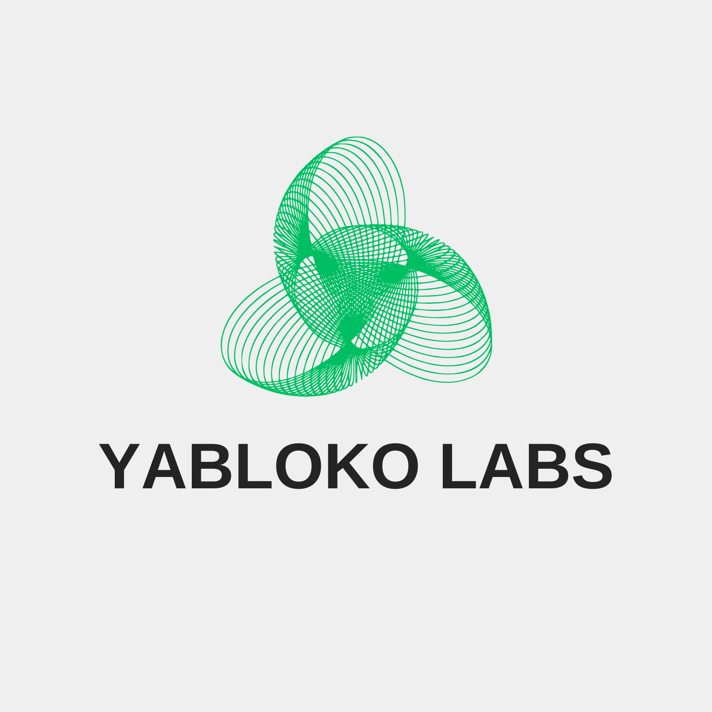

<div align="center">

<div style="max-width: 800px; margin: 0 auto;">

# D-Wave Ocean SDK Docker Environment

[](https://hub.docker.com/r/dwavesys/ocean-dev)
[](https://opensource.org/licenses/MIT)
[](https://github.com/yablokolabs/dwave-ocean-docker)
[](https://en.wikipedia.org/wiki/Quantum_computing)

> **Maintained by [Yabloko Labs](https://yablokolabs.com) — Building quantum-inspired SaaS solutions**



A complete, production-ready Docker environment for experimenting with D-Wave quantum annealing using the Ocean SDK. Get up and running with quantum computing in minutes, not hours.

> **Note**: This project is not affiliated with D-Wave Systems Inc. It provides a community-maintained Docker environment for working with the open source D-Wave Ocean SDK.

</div>

## 🚀 Why This Repository?

<div align="left">

- **Production-Ready**: Battle-tested Docker environment with all dependencies pre-configured
- **Complete Examples**: From basic QUBO to complex TSP implementations
- **Zero Setup Time**: One command gets you coding with quantum algorithms
- **Educational Focus**: Step-by-step tutorials and interactive Jupyter notebooks
- **Real Hardware Ready**: Easy migration from simulation to actual D-Wave systems

</div>

## Quick Start

<div align="left">

### 1. Run the Docker Environment

```bash
cd dwave-project
./run_dwave_env.sh
```

This will start the D-Wave Ocean development container with all necessary packages pre-installed.

### 2. Inside the Container

Once inside the container, you can run the example scripts:

```bash
# Basic D-Wave examples
python basic_examples.py

# Traveling Salesman Problem example
python tsp_example.py

# Start Jupyter notebook for interactive development
jupyter notebook --ip=0.0.0.0 --port=8888 --no-browser --allow-root
```

</div>

## What's Included

<div align="left">

### Example Files

<div align="left">

- **`basic_examples.py`**: Fundamental D-Wave Ocean SDK examples including:
  - Basic QUBO problems
  - Maximum Cut problem
  - Constraint Satisfaction Problems
  - Ising model examples

- **`tsp_example.py`**: Complete Traveling Salesman Problem implementation with:
  - BQM formulation for TSP
  - Solution decoding
  - Brute force verification for small instances

- **`dwave_tutorial.ipynb`**: Interactive Jupyter notebook with:
  - Step-by-step tutorials
  - Visualization examples
  - Interactive problem builders

</div>

### Docker Image Features

<div align="left">

The `dwavesys/ocean-dev` Docker image includes:

- **D-Wave Ocean SDK**: Complete quantum annealing toolkit
- **dimod**: Binary quadratic model manipulation
- **dwave-system**: D-Wave hardware integration
- **dwavebinarycsp**: Constraint satisfaction problems
- **Jupyter**: Interactive notebook environment
- **Scientific Python stack**: NumPy, SciPy, Matplotlib, NetworkX

</div>

## Problem Types Demonstrated

<div align="left">

### 1. QUBO (Quadratic Unconstrained Binary Optimization)
Basic optimization problems with binary variables.

### 2. Maximum Cut
Graph partitioning to maximize edges between partitions.

### 3. Constraint Satisfaction
Problems with logical constraints between variables.

### 4. Traveling Salesman Problem
Classic optimization problem for finding shortest tours.

### 5. Ising Models
Spin glass problems from statistical physics.

</div>

## Development Workflow

<div align="left">

### For Quick Testing
```bash
# Run the container and execute examples
./run_dwave_env.sh
python basic_examples.py
```

### For Interactive Development
```bash
# Start container with Jupyter
./run_dwave_env.sh
jupyter notebook --ip=0.0.0.0 --port=8888 --no-browser --allow-root
```

Then access the notebook at `http://localhost:8888`

### For Custom Development
1. Add your Python files to the `dwave-project/` directory
2. Run the container to access them at `/workspace`
3. Install additional packages if needed with `pip install`

</div>

## D-Wave Hardware Access

<div align="left">

To use real D-Wave quantum hardware:

1. **Sign up**: Visit [D-Wave Cloud](https://cloud.dwavesys.com/)
2. **Get API token**: Generate your authentication token
3. **Configure**: Inside the container, run:
   ```bash
   dwave config create
   ```
4. **Update code**: Replace `SimulatedAnnealingSampler()` with:
   ```python
   from dwave.system import DWaveSampler, EmbeddingComposite
   sampler = EmbeddingComposite(DWaveSampler())
   ```

</div>

## Troubleshooting

<div align="left">

### Docker Issues
```bash
# If permission denied
sudo usermod -aG docker $USER
# Then logout and login again

# If container fails to start
sudo systemctl start docker
```

### Python Package Issues
```bash
# Inside container, install additional packages
pip install package-name

# Update Ocean SDK
pip install --upgrade dwave-ocean-sdk
```

</div>

## 🌐 About Yabloko Labs

<div align="left">

This repository is maintained by **[Yabloko Labs](https://yablokolabs.com)**, a cutting-edge quantum-AI company specializing in:

- **[Q-Router](https://github.com/yablokolabs/q-router)**: Quantum-inspired routing optimization
- **[Q-Porter](https://github.com/yablokolabs/q-porter)**: Quantum portfolio management tools  
- **[Q-Consent](https://github.com/yablokolabs/q-consent)**: Privacy-first consent management

We're building the future of quantum-inspired SaaS solutions. [Learn more about our mission »](https://yablokolabs.com)

</div>

## 📚 Learning Resources

<div align="left">

- [D-Wave Ocean Documentation](https://docs.ocean.dwavesys.com/)
- [D-Wave Examples](https://github.com/dwave-examples)
- [Quantum Annealing Tutorial](https://docs.dwavesys.com/docs/latest/c_gs_2.html)
- [Ocean SDK GitHub](https://github.com/dwavesystems/dwave-ocean-sdk)

</div>

## 🌟 Community & Contributing

<div align="left">

### 💬 Join the Discussion
- **Reddit**: [r/quantumcomputing](https://reddit.com/r/quantumcomputing)
- **LinkedIn**: [Yabloko Labs Company Page](https://www.linkedin.com/in/yabloko-labs-4858bb366/)

### 👤 Contributing
We welcome contributions! Whether it's:
- 🐛 Bug fixes
- 📝 Documentation improvements  
- ✨ New quantum algorithms
- 📊 Performance optimizations

**[Open an issue](https://github.com/yablokolabs/dwave-ocean-docker/issues)** or submit a pull request.

### 🏆 Recognition
Contributors will be featured in our:
- 📰 Company blog posts
- 📢 Social media highlights
- 🎆 Annual contributor awards

</div>

## Project Structure

<div align="left">

```
dwave-ocean-docker/
├── basic_examples.py         # Fundamental examples
├── tsp_example.py           # TSP implementation  
├── dwave_tutorial.ipynb     # Interactive tutorial
├── quick_start.py           # Setup verification
├── requirements.txt         # Python dependencies
├── run_dwave_env.sh        # Docker startup script
├── README.md               # This documentation
├── LICENSE                 # MIT License
├── CONTRIBUTING.md         # Contribution guidelines
├── CHANGELOG.md            # Version history
├── .gitignore             # Git ignore patterns
├── marketing_launch.sh     # Launch checklist
└── BLOG_POST_TEMPLATE.md   # Marketing content template
```

</div>

## Next Steps

<div align="left">

1. **Experiment**: Modify the existing examples
2. **Learn**: Work through the Jupyter notebook
3. **Build**: Create your own optimization problems
4. **Scale**: Try larger problems with D-Wave hardware
5. **Optimize**: Tune annealing parameters for better results

Happy quantum computing! 🚀

</div>

---

## 📬 Get in Touch

<div align="left">

**Yabloko Labs** • Building quantum-inspired SaaS
- 🌐 Website: [yablokolabs.com](https://yablokolabs.com)
- 📧 Email: support@yablokolabs.com
- 💼 LinkedIn: [company/yablokolabs](https://www.linkedin.com/in/yabloko-labs-4858bb366/)

### 🎯 Our Goals
- 🌟 **Awesome Quantum Computing** community contributions

</div>

---

<sub>🔖 <em>This repository is part of Yabloko Labs' commitment to open-source quantum computing tools. Star us if this helped your research!</em></sub>

</div>
</div>